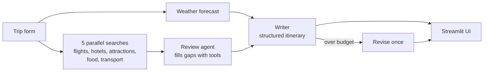

# AI Travel Planner

An agentic AI that plans your trip. Enter where you're going, when, and your budget. It researches live flights,
hotels, attractions, food and weather, then writes a day-by-day itinerary that fits your budget.

**Example output:** [examples/london-5-day-trip.md](examples/london-5-day-trip.md)

- **One API key only.** Search, weather and exchange rates are free and need no key.
- **Live progress.** See each research step as it happens.
- **Clear results.** Day cards, a budget table and chart, weather, and a Markdown download.
- **Token usage shown** for every run.
- **Stays in budget.** If the first plan costs too much, it is revised once.

## How it works



1. **Forecast** from Open-Meteo (covers the next 16 days).
2. **Research:** five web searches run in parallel. A LangChain agent reviews them and calls more tools only to fill
   a gap, such as a failed search or a currency conversion.
3. **Write:** one LLM call returns the full itinerary as validated data. The total cost is calculated in code.
4. **Check:** if the total is over budget, the plan is rewritten once with cheaper choices.

## Setup

You need **Python 3.11+**, **git**, and an **API key** for an OpenAI-compatible LLM.

**1. Clone**

```bash
git clone https://github.com/arunak1998/Ai_Agents.git
cd Ai_Agents
```

**2. Create a virtual environment**

```bash
python -m venv .venv
source .venv/bin/activate        # Windows (PowerShell): .venv\Scripts\Activate.ps1
```

**3. Install**

```bash
pip install -e .
```

This also installs the `langchain-openai` model package. To use a different provider (Anthropic, Gemini, ...), install
its LangChain package (for example `pip install langchain-anthropic`) and swap the model class in
[`src/travel_planner/llm.py`](src/travel_planner/llm.py), the only place the model is created.

**4. Add your API key**

```bash
cp .env.example .env             # Windows (PowerShell): copy .env.example .env
```

Open `.env` and replace `your_api_key_here`:

```
LLM_API_KEY=sk-...
```

| Setting | Required | Purpose |
|---|---|---|
| `LLM_API_KEY` | **Yes** | Your API key. |
| `LLM_BASE_URL` | No | Only for a gateway or proxy. Leave it out to use OpenAI directly. |
| `LLM_MODEL` | No | Model name. Default `gpt-5-mini`. |
| `LLM_REASONING_EFFORT` | No | `minimal` speeds up gpt-5 models. Delete the line for other models. |

`.env` is git-ignored, so your key is never committed.

**5. Run**

```bash
streamlit run src/travel_planner/ui/app.py
```

Open <http://localhost:8501>, fill in the form on the left, and press **Plan my trip**.

## Cost and speed

A trip typically uses **10,000-20,000 tokens** and takes **30-60 seconds** with `gpt-5-mini`. The **Run details** tab
shows the exact numbers for each run.

## Troubleshooting

| Problem | Fix |
|---|---|
| `LLM_API_KEY is not set` | Create `.env` from `.env.example` and set the key, then restart the app. |
| `Unsupported parameter: reasoning_effort` | Your model isn't a reasoning model. Delete the `LLM_REASONING_EFFORT` line. |
| "Search unavailable" in a section | Free search is occasionally rate-limited. Plan the trip again. |
| No weather shown | Forecasts cover the next 16 days only. Choose a closer start date. |
| `command not found: streamlit` | Activate the virtual environment and run `pip install -e .` again. |

## Project layout

```
src/travel_planner/
├── planner.py       # the flow: forecast, research, write, revise (reports progress as events)
├── tools.py         # LangChain tools: searches and currency conversion
├── models.py        # TripRequest, TripPlan (what the LLM returns), PlanResult
├── prompts.py       # research and writer prompts
├── llm.py           # the one place the LLM is created
├── export.py        # plan to Markdown
├── services/        # search, weather, currency, budget split
└── ui/              # Streamlit app, result tabs, progress messages
tests/               # pytest suite (no network or API key needed)
examples/            # a real generated itinerary
.env.example         # copy to .env
```

## Development

```bash
pip install -e ".[dev]"
pytest
ruff check . && ruff format --check .
```

Prices come from web search snippets and model estimates. Verify them before booking.
