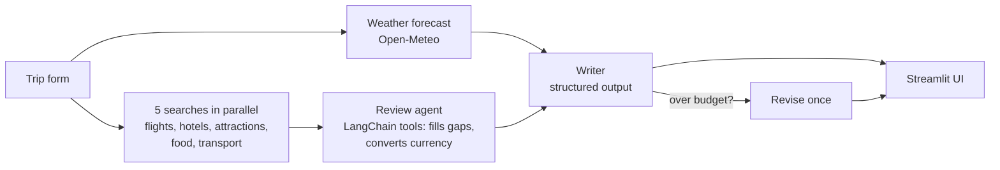

# AI Travel Planner

An agentic AI that plans a trip for you. Tell it where you're going, when, and your budget. It researches live
flights, hotels, attractions, food and weather, then writes a day-by-day itinerary that fits your budget, and shows
you exactly how many tokens it used.

**Example output:** [examples/london-5-day-trip.md](examples/london-5-day-trip.md) (Chennai → London, 5 days, 2 travelers).

- **Only one API key needed.** Search (DuckDuckGo), weather (Open-Meteo) and exchange rates need no key.
- **Live progress.** Watch each research step happen, instead of waiting on a spinner.
- **Structured itinerary.** Day cards, a budget table and chart, a weather table, and a Markdown download.
- **Token usage shown.** Input, output and total tokens for every run.
- **Stays in budget.** If the first draft costs more than your budget, the planner revises it once.

## How it works



1. **Forecast.** A plain API call for the trip dates (covers the next 16 days).
2. **Research.** Five searches run in parallel. A LangChain agent then reviews the results and calls more tools only
   to fill a gap, such as a failed search or a price in another currency.
3. **Write.** One LLM call returns the whole itinerary as validated Pydantic data (`TripPlan`), not free text. The
   total cost is computed from the budget lines in code, never taken from the model's word.
4. **Check.** If the total is over budget, the writer is asked once to redo the plan with cheaper choices.

**Why fixed searches instead of letting the agent pick them?** In testing, the model sometimes made the five calls one
turn at a time, re-sending a growing context each time and using up to 4x the tokens. Running the five searches
in parallel up front is faster, cheaper and repeatable. The agent still decides what else is needed.

## Setup (about 5 minutes)

You need **Python 3.11 or newer**, **git**, and an **API key** for an OpenAI-compatible LLM.

### Step 1. Clone the code

```bash
git clone https://github.com/arunak1998/Ai_Agents.git
cd Ai_Agents
```

### Step 2. Create a virtual environment

```bash
python -m venv .venv
source .venv/bin/activate        # Windows (PowerShell): .venv\Scripts\Activate.ps1
```

### Step 3. Install the package

```bash
pip install -e .
```

This installs everything, including the `langchain-openai` model package.

> **Using a model that is not OpenAI-compatible** (Anthropic, Gemini, ...)? Install that provider's LangChain package,
> for example `pip install langchain-anthropic`, then swap the model class in
> [`src/travel_planner/llm.py`](src/travel_planner/llm.py). That file is the only place the model is created.

### Step 4. Add your API key

```bash
cp .env.example .env             # Windows (PowerShell): copy .env.example .env
```

Open `.env` and set your key on the `LLM_API_KEY` line:

```
LLM_API_KEY=your_api_key_here
```

| Setting | Required? | What it is |
|---|---|---|
| `LLM_API_KEY` | **Yes** | Your API key. This is the only thing you must change. |
| `LLM_BASE_URL` | No | Only needed for an OpenAI-compatible gateway or proxy. Leave it out to use OpenAI directly. |
| `LLM_MODEL` | No | Model name. Default: `gpt-5-mini`. |
| `LLM_REASONING_EFFORT` | No | `minimal` makes gpt-5 models faster. Delete the line for other models such as `gpt-4.1`. |

`.env` is git-ignored, so your key is never committed.

### Step 5. Run the app

```bash
streamlit run src/travel_planner/ui/app.py
```

Your browser opens at <http://localhost:8501>. Fill in the form on the left and press **Plan my trip**.

## Cost and speed

A typical trip uses **10,000 to 20,000 tokens** and takes **30 to 60 seconds** with `gpt-5-mini`. The **Run details**
tab shows the exact numbers for each run. Most tokens go to reading the search results and writing the itinerary.
A revision (only when over budget) adds one more writing call.

## Troubleshooting

| Problem | Fix |
|---|---|
| `LLM_API_KEY is not set` | Create `.env` from `.env.example` (step 4) and restart the app. |
| `Unsupported parameter: reasoning_effort` | Your model is not a reasoning model. Delete the `LLM_REASONING_EFFORT` line in `.env`. |
| A section says "Search unavailable" | Free web search is occasionally rate-limited. Run the plan again; the planner tries several search backends. |
| No weather shown | Forecasts only cover the next 16 days. Pick an earlier start date for live weather. |
| `command not found: streamlit` | Activate the virtual environment (step 2) and run `pip install -e .` again (step 3). |

## Project layout

```
src/travel_planner/
├── planner.py          # the 3-step flow, reports progress as events
├── tools.py            # LangChain tools: flights, hotels, attractions, restaurants, transport, currency
├── models.py           # TripRequest, TripPlan (what the LLM must return), PlanResult
├── prompts.py          # research and writer prompts
├── llm.py              # the one place the LLM is created
├── export.py           # plan -> Markdown
├── services/
│   ├── search.py       # keyless web search with backend fallback
│   ├── weather.py      # Open-Meteo forecast
│   ├── currency.py     # live exchange rates
│   └── budget.py       # target split of the budget by category
└── ui/
    ├── app.py          # Streamlit app: form, live progress
    ├── render.py       # itinerary, budget, weather and run-details tabs
    └── progress.py     # planner events -> status messages
tests/                  # pytest suite (no network or API key needed)
examples/               # a real generated itinerary
.env.example            # sample settings: copy to .env
```

## Development

```bash
pip install -e ".[dev]"
pytest                          # tests use fakes; no API key or network needed
ruff check . && ruff format --check .
```

Prices come from web search snippets and model estimates. Always verify before booking.
